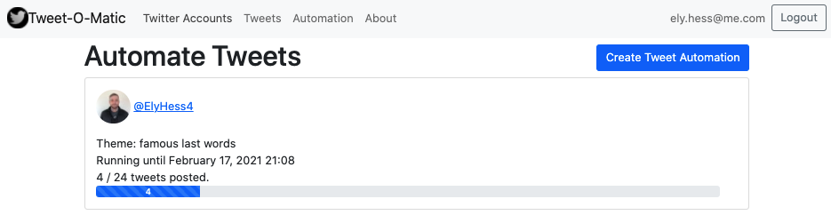
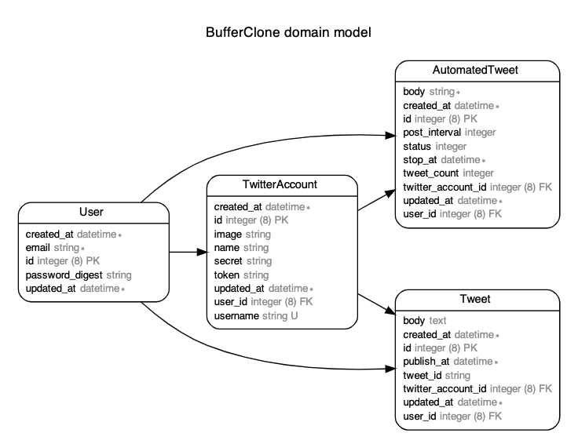

<!-- Shields -->



<!-- TABLE OF CONTENTS -->
<summary><h2 style="display: inline-block">Table of Contents</h2></summary>
<ol>
  <li><a href="#about-the-project">About The Project</a>
  <li><a href="#project-board">Project Board</a></li>
  <li><a href="#database-schema">Database Schema</a></li>
  <li><a href="#built-with">Built With</a>
  <li><a href="#setup-instructions">Setup Instructions</a></li>
  <li><a href="#contact">Contact</a></li>
  <li><a href="#acknowledgements">Acknowledgements</a></li>
</ol>


<!-- ABOUT THE PROJECT -->
## About The Project

[Tweet-O-Matic](https://tweet-o-matic.herokuapp.com/) is a twitter bot application that allows users to connect their Twitter accounts, schedule tweets and set up tweet automations for timed twitter posts. This is a proof of concept project built with the purpose of exploring new technologies. Create an account, connect one or more Twitter profiles to your newly created account and begin tweeting incessantly!

### Recent Challenges
* April 2021
   - Building out Javascript functionality for dynamic progress bar updates for in progress twitter bots.
* May 2021
   - Upgrading from rails 5.2.4.3 -> 6.1.3.1.
   - Installing Webpack and migrating over existing ActionCable functionality.
   - Complete re-imagining of UI, Bootstrap -> Tailwind.
   - Setting up ActionMailer in production for password reset support.
   - Refactoring vanilla Javascript automated tweet progress bar functionality into Tailwind + ActionCable + Stimulus.js.


<!-- PROJECT BOARD -->
## Project Board
Check out the [Project board](https://github.com/elyhess/tweet_o_matic/projects/1) for a complete list of upcoming additions to this project.

<!-- DATABBASE SCHEMA -->
## Database Schema



<!-- BUILT WITH -->
## Built With

* [Ruby on Rails](https://rubyonrails.org/)
* [PostgreSQL](https://www.postgresql.org/)
* [Stimulus.js](https://stimulus.hotwire.dev/)
* [Tailwind CSS](https://tailwindcss.com/)
* [Redis](https://redis.io/)
* [Sidekiq](https://sidekiq.org/)
* [Heroku](https://tweet-o-matic.herokuapp.com)

<!-- SETUP INSTRUCTIONS -->
## Setup Instructions
To get a local copy up and running follow these simple steps.

1. Clone the repo
   ```
   git clone https://github.com/elyhess/tweet_o_matic
   ```
2. Install dependencies
   ```
   bundle install
   ```
3. DB creation/migration
   ```
   rails db:create
   rails db:migrate
   rails db:seed
   ```
4. Run server and navigate to http://localhost:3000/
   ```
   rails s
   ```
OR

1. Visit heroku and create an account / sign in
   ```
   https://tweet-o-matic.herokuapp.com/
   ```

<!-- CONTACT -->
## Contact
* [Ely Hess](https://github.com/elyhess) - ely.hess@me.com